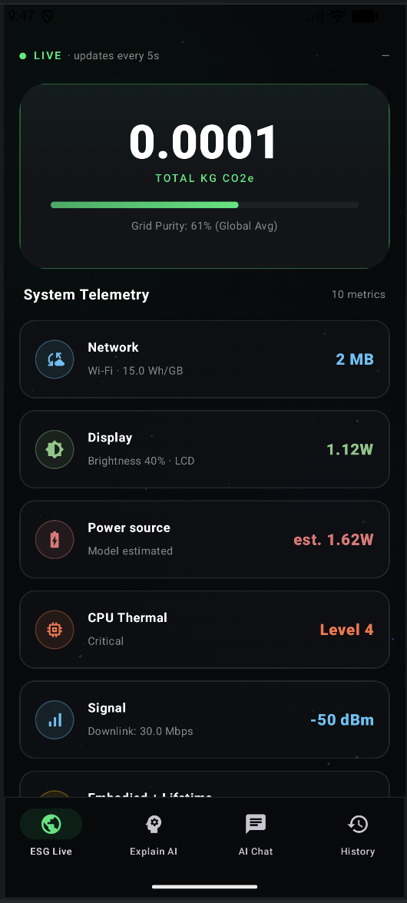
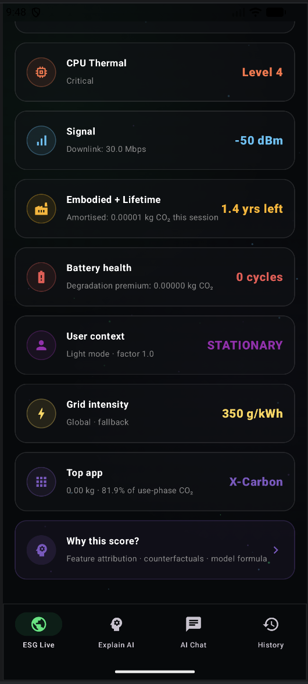
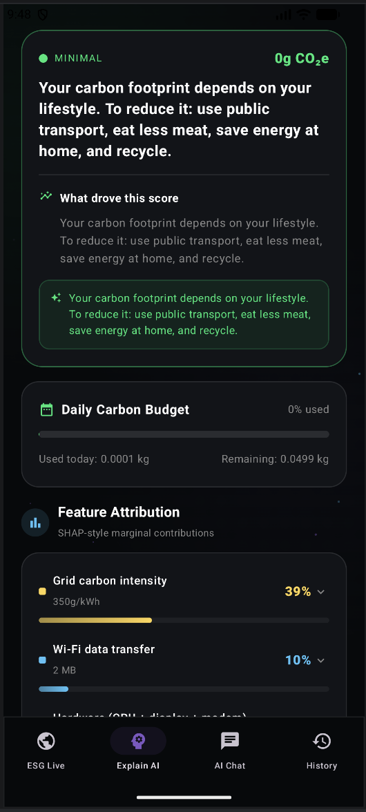
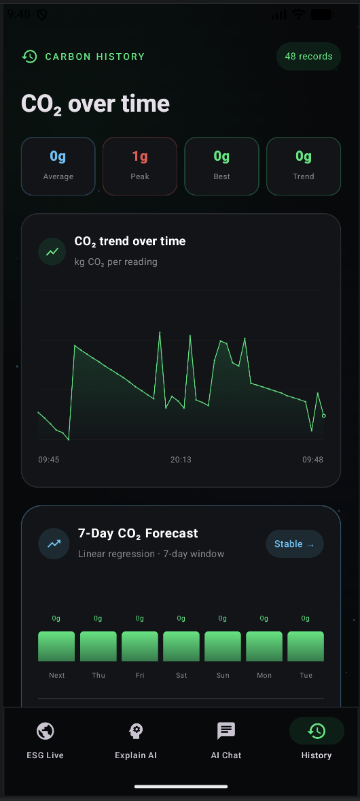
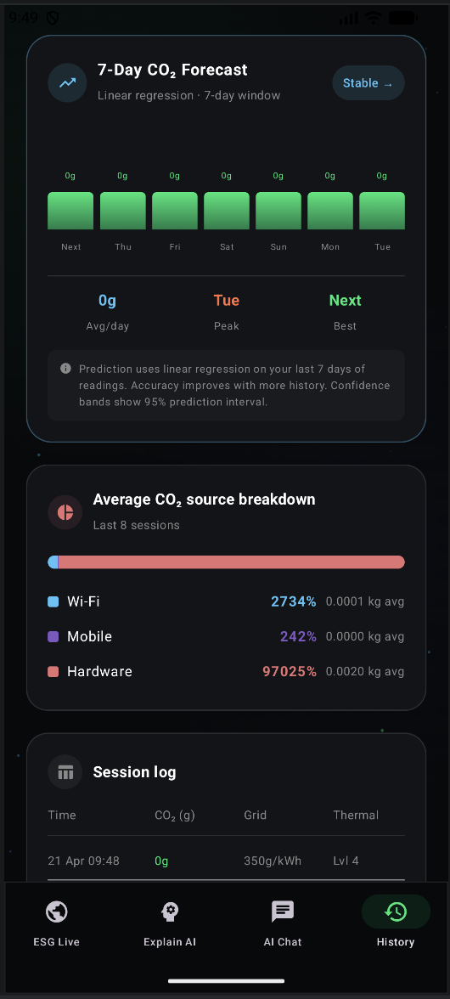
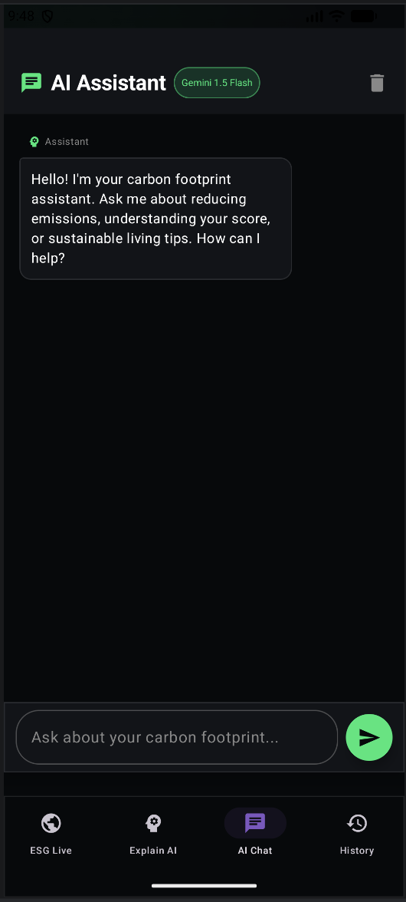

# X-Carbon

A mobile ESG intelligence system for estimating and explaining the carbon footprint of smartphone digital behavior in near real time.

X-Carbon is an Android application that combines on-device telemetry, grid carbon intensity retrieval, hybrid carbon accounting, explainable AI, and assistant-style interaction to help users understand and reduce the emissions associated with their mobile usage.

## Table of Contents

1. [Project Overview](#project-overview)
2. [Research Motivation](#research-motivation)
3. [Contributions](#contributions)
4. [System Architecture](#system-architecture)
5. [Methodology](#methodology)
6. [Explainable AI Layer](#explainable-ai-layer)
7. [Prediction Module](#prediction-module)
8. [Data Storage and Synchronization](#data-storage-and-synchronization)
9. [App Features and UX Flow](#app-features-and-ux-flow)
10. [Tech Stack](#tech-stack)
11. [Repository Structure](#repository-structure)
12. [Build and Run Instructions](#build-and-run-instructions)
13. [Configuration and Secrets](#configuration-and-secrets)
14. [Permissions and Privacy](#permissions-and-privacy)
15. [Model Assumptions and Limitations](#model-assumptions-and-limitations)
16. [Known Implementation Issues](#known-implementation-issues)
17. [Roadmap](#roadmap)
18. [License](#license)

## Project Overview

X-Carbon estimates the carbon footprint of mobile-device usage sessions by fusing:

- Network activity telemetry (Wi-Fi/mobile transfer volumes)
- Device-state telemetry (battery, screen brightness, thermal proxy, network quality)
- Grid carbon intensity (live API or regional fallback)
- Behavioral modifiers (dark mode and coarse activity context)
- Embodied-carbon amortization and battery degradation premium

It then provides:

- Real-time ESG dashboard updates (every 5 seconds)
- Explainability outputs (feature attribution and counterfactuals)
- Forecasted future trend estimates
- Notification-based threshold alerts
- Conversational assistant support through Gemini with offline fallback

## Research Motivation

The project addresses a practical gap in digital sustainability: users and organizations can estimate transport and electricity emissions relatively well, but have weak tooling for understanding the environmental cost of everyday mobile digital behavior.

X-Carbon is designed as a deployable system that can support both:

- Human-in-the-loop eco-feedback
- Research workflows in digital carbon accounting and explainable sustainability analytics

## Contributions

1. A hybrid mobile carbon accounting engine combining measured and modeled energy estimation.
2. A multi-factor footprint model that includes use-phase, embodied-carbon amortization, and degradation premium.
3. An explainability layer that surfaces attributions, narrative interpretation, and action-oriented counterfactuals.
4. A real-time carbon intensity integration pipeline with graceful fallback behavior.
5. A practical Android implementation that can serve as a basis for experimental studies and longitudinal trials.

## System Architecture

X-Carbon uses a modular architecture with seven major layers:

1. Telemetry acquisition
- Reads network stats, battery/charging state, screen brightness, signal/downlink, CPU thermal proxy, and usage-time distribution.

2. Contextual carbon intensity retrieval
- Fetches location-aware grid intensity from ElectricityMaps.
- Falls back to country/region defaults when live retrieval fails.

3. Carbon accounting engine
- Converts telemetry to energy and then to CO2e.
- Supports battery-measured mode when available and valid.

4. Explainable AI engine
- Computes attribution-style decomposition and counterfactual recommendations.
- Optionally augments narrative sections using Gemini.

5. Prediction engine
- Fits linear trend over historical records and emits short-horizon forecast bands.

6. Persistence and cloud sync
- Local cache via SharedPreferences.
- Cloud history sync via Azure Cosmos DB REST interface.

7. Presentation and interaction
- Multi-screen Compose UI (Dashboard, XAI, Chat, History) with periodic updates and notification triggers.

## Methodology

### 1. Telemetry Inputs

Key session-level inputs include:

- Wi-Fi and mobile traffic volume (MB)
- Network type and downlink characteristics
- Battery percent, capacity estimate, voltage, charging state
- Screen brightness and display type proxy
- CPU thermal level proxy from frequency ratios
- Estimated battery cycle count
- Grid intensity value in kg CO2/kWh

### 2. Energy Model

The engine estimates:

- Network energy from transfer volume and network-specific kWh/GB constants
- Data-center energy from transfer volume and fixed data-center intensity
- Device-side energy from display, CPU, and modem power models

When battery-derived power is available in realistic bounds, the system uses measured energy mode; otherwise it uses model-estimated mode.

### 3. Carbon Model

Use-phase emissions are computed from total energy and grid intensity.

Additional components:

- Embodied-carbon amortization over predicted remaining lifetime
- Degradation premium due to charging inefficiency as cycle count increases
- Behavioral factor adjustment (for context such as dark mode/activity)

The final session estimate is:

- Total CO2e = (use-phase + embodied amortization + degradation premium) x behavior factor

### 4. Per-App Attribution

A simplified per-app allocation distributes use-phase CO2 by foreground time share over the session horizon, reporting top contributors.

## Explainable AI Layer

The XAI layer outputs:

- Impact class (minimal to critical)
- Feature attribution entries for Wi-Fi, mobile data, hardware, and grid factors
- Counterfactual recommendation cards (for example, mobile-to-Wi-Fi switch)
- Confidence score and carbon budget framing
- Narrative headline, explanation, and eco-tip (Gemini-augmented when key is configured)

Design goal: combine quantitative decomposition with human-readable reasoning and actionable intervention guidance.

## Prediction Module

The prediction module:

- Requires a minimum history threshold before forecasting
- Uses linear regression over historical sequence
- Computes trend category (improving/stable/worsening)
- Emits 7 future steps with uncertainty bounds

This is intentionally lightweight and explainable for mobile deployment, but can be replaced with richer time-series models for research variants.

## Data Storage and Synchronization

### Local

- Carbon history records are serialized and stored in SharedPreferences.
- Recent-window retention is applied (last 48 records).

### Cloud (Azure Cosmos DB)

- Records are stored as per-user documents (current implementation uses a default user id).
- Load path supports query pagination through continuation tokens.
- Save/load failures are handled gracefully to preserve local functionality.

## App Features and UX Flow

### Dashboard

- Live CO2e card
- Grid intensity compact card
- Telemetry cards
- Update interval: 5 seconds

### Explain AI Screen

- Impact verdict and rationale
- Carbon budget visualization
- Feature attribution bars
- Counterfactual opportunities

### Chat Screen

- Gemini-backed assistant for carbon questions
- Built-in offline fallback responses when API is unavailable

### History Screen

- Session summaries and line chart
- Source breakdown view
- Forecast card with trend indicator and confidence band interpretation
- Recent session log

### Notifications

- Threshold-based alerts (low, moderate, high, critical)
- Notification channels for alerts, updates, and tips

## Visual Walkthrough

Selected interface snapshots are included below to highlight the key app workflows.

### 1. Live ESG Dashboard



### 2. System Telemetry View



### 3. Explainable AI Interpretation



### 4. Historical and Forecasted Trends





### 5. AI Assistant Interaction



## Tech Stack

- Language: Kotlin
- Platform: Android (minSdk 26, targetSdk 35)
- UI: Jetpack Compose + Material3
- Async: Kotlin Coroutines
- Networking: OkHttp + Retrofit + Gson
- Location: Google Play Services Location
- AI: Google Generative AI SDK (Gemini)
- Cloud: Azure Cosmos DB REST API
- Build: Gradle Kotlin DSL, Java 17 toolchain

## Repository Structure

```text
X-Carbon/
  app/
    src/main/java/com/example/x_carbon/
      MainActivity.kt
      CarbonCalculationEngine.kt
      GridIntensityService.kt
      XAIEngine.kt
      CarbonPredictionEngine.kt
      CarbonHistoryScreen.kt
      ChatScreen.kt
      GeminiService.kt
      AzureDbService.kt
      CarbonNotificationService.kt
      CarbonHistoryStorage.kt
    src/main/AndroidManifest.xml
    build.gradle.kts
  gradle/libs.versions.toml
  build.gradle.kts
  settings.gradle.kts
```

## Build and Run Instructions

### Prerequisites

- Android Studio (latest stable recommended)
- JDK 17
- Android SDK 35
- A physical device or emulator with Google Play Services

### Steps

1. Clone repository.
2. Open in Android Studio.
3. Add required API keys to local.properties (see below).
4. Sync Gradle.
5. Run app module on device/emulator.

## Configuration and Secrets

The app reads runtime secrets from local.properties and exposes them via BuildConfig:

```properties
# local.properties (do not commit)
GEMINI_API_KEY=your_gemini_api_key
AZURE_COSMOS_KEY=your_azure_cosmos_master_key
```

Required external services:

- Gemini API key for AI-generated explanations and chat responses
- Azure Cosmos DB key for cloud history persistence
- ElectricityMaps access token (currently hardcoded in service; should be externalized)

## Permissions and Privacy

Declared permissions include:

- INTERNET
- ACCESS_NETWORK_STATE
- ACCESS_COARSE_LOCATION
- ACCESS_FINE_LOCATION
- PACKAGE_USAGE_STATS
- READ_NETWORK_USAGE_STATS
- POST_NOTIFICATIONS

Usage intent:

- Carbon estimation from network/device telemetry
- Grid intensity localization
- Notification delivery

Privacy note:

- The current implementation uses a static cloud user id and does not yet implement formal user identity, consent UI, or data governance controls expected in production deployments.

## Model Assumptions and Limitations

1. Several energy constants are literature-style heuristics and may vary by device/network/operator.
2. Thermal state is approximated from CPU frequency ratio, not direct die temperature.
3. OLED/LCD detection uses a proxy and may misclassify some devices.
4. Location-to-country mapping uses bounding-box heuristics, not full geocoding.
5. Forecasting uses simple linear regression and does not capture seasonality or context shifts.
6. Per-app carbon allocation uses foreground-time proportion and may under-represent background activity.
7. Grid intensity can fall back to regional defaults when live retrieval is unavailable.

These choices are suitable for an explainable prototype and research baseline, but not yet a certified carbon accounting standard.

## Known Implementation Issues

1. Dependency declarations contain duplicates and version inconsistencies in app/build.gradle.kts (both version-catalog and direct hardcoded entries are present).
2. ElectricityMaps API token is hardcoded in source and should be moved to secure local/build config.
3. Manifest includes usage/network stats permissions that may be restricted or OEM-dependent in practice.
4. Cloud sync currently uses a fixed user id and no authentication boundary.
5. History retention and sorting logic should be reviewed for consistent chronological semantics across views.
6. Some legacy XML layout artifacts remain even though primary UI is Compose-driven.

## Roadmap

1. Externalize all secrets and tokens to secure config.
2. Add formal experiment mode with data export for reproducibility.
3. Introduce authenticated multi-user cloud storage.
4. Replace linear forecast with validated time-series models.
5. Add calibration flow for device-specific energy constants.
6. Improve privacy controls, consent flow, and policy documentation.
7. Add unit/instrumentation tests for core modeling modules.

## License

This project is licensed under the MIT License.

See the [LICENSE](LICENSE) file for full text.
